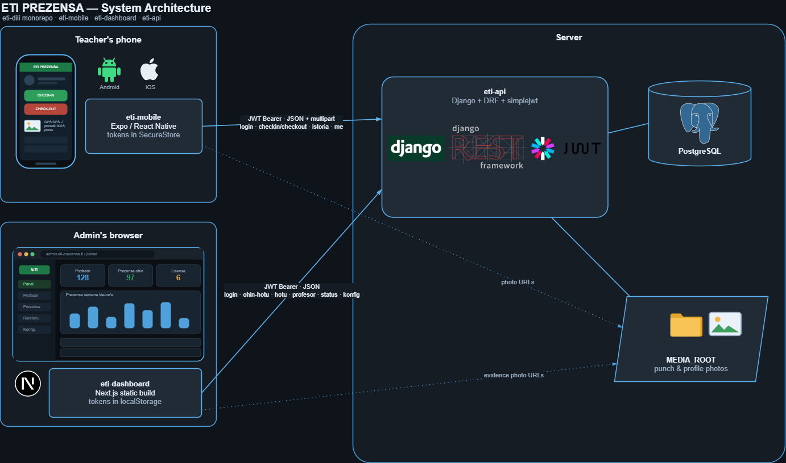

# ETI PREZENSA — Panel Administrasaun

The administration dashboard for **ETI PREZENSA**, the system that replaces the
paper attendance book of **Escola Técnica de Informática Dili**, Timor-Leste.

The book it replaces is a printed sheet — *"LISTA PREZENSA BA PROFESÓR/A ETI
DILI"* — one page per teacher per month, with a row for every working day and
four time columns the teacher fills in by hand and signs. That signature is the
only proof anyone was ever there. ETI PREZENSA keeps the sheet exactly as it is
printed, and replaces the signature with a photo and a GPS reading taken at the
moment of the punch.

This repository is the **dashboard the administration uses**. It does not record
attendance itself — teachers punch from their phones. Everything here is about
reading what they recorded, filling in the days they could not punch, and
printing the month.

> The interface is entirely in **Tetun**, the language of the school. There is a
> [glossary](#glossary) at the bottom for anyone reading the code.

---

## How the pieces fit



| Repository | What it is | Who uses it |
| --- | --- | --- |
| `eti-api` | Django + DRF + SimpleJWT, PostgreSQL. Owns the sheets, the punches and the evidence. | — |
| `eti-mobile` | Expo / React Native. Clock in, clock out, own history. Tokens in SecureStore. | Teachers |
| `eti-dashboard` | **This repo.** Next.js 16, App Router. Tokens in localStorage. | Administration |

Both clients speak the same REST API with a JWT bearer token, and both read the
photos straight from `MEDIA_ROOT` by the URLs the API hands back. There is no
server between the dashboard and the API — every route here prerenders to static
HTML and does its work in the browser.

**The dashboard is admin-only.** A `PROFESSOR` account is refused at the login
screen before any token is stored: every screen behind it calls an admin-only
route, so signing one in would only mean a 403 on each of them.

---

## What the dashboard does

Five screens, in the order they sit in the sidebar.

### Panel — the day at a glance

The screen the administration opens in the morning. Four counters — teachers on
the roster, how many have punched, how many have not, how many arrived late —
over the full list of the school for today.

Teachers who have **not** punched are listed too, which is the whole reason to
open it. Reading a punch opens the evidence behind it: the photo taken at that
moment and the point on the map where the phone was, with the distance from the
school and whether it fell inside the geofence.

*Reads `GET /api/prezensa/ohin-hotu/`.*

### Profesór sira — the roster

Every account the school has, teachers and administrators alike, including
deactivated ones (badged *Dezativadu*, and reactivatable).

- **Aumenta Profesór** — create an account. The server generates the first
  password and returns it exactly once; the dashboard shows it with a copy
  button, because it is never stored and never returned again.
- **Atualiza** — edit the fields of the printed sheet: naran kompletu, numeru
  ID, kargu, habilitasaun literária, disiplina hanorin, nivel edukasaun, aréa
  estudu, contact, sex, photo.
- **Dezativa / Ativa** — someone who left the school. Their sheets are kept.
- **Reset password** — there is no self-service reset and no e-mail delivery in
  the school's network, so a teacher who loses their password asks the admin,
  who sets a new one and hands it over in person.
- **Hamos** — irreversible removal, which takes every sheet, day and punch with
  it. Guarded by a typed password confirmation. An admin account cannot be
  deleted or reset from here at all; the API refuses it as well.

*Reads and writes `/api/profesor/`.*

### Prezensa — the grid

The paper book itself, on screen: one line per teacher per working day for the
chosen period, empty days included, Sundays skipped. Filter by day, week, month
or year, and by one teacher or all of them.

Each of the four time cells shows the punch and whether it was late against the
scheduled time; clicking it opens the photo and the map.

**Rejistu Lisensa** is the other half of this screen — the days a teacher could
not punch. The admin hand-writes a status over a date range (*Lisensa*,
*Misaun*, *Feriadu*, *Falta*) with a reason in OBS. A day that already holds
punches blocks the whole request: a punch is evidence and must never be
quietly buried under a leave.

*Reads `GET /api/prezensa/hotu/`, writes `POST`/`DELETE /api/prezensa/status/`.*

### Relatóriu — the month, printed

The report that gets filed. Same filters — all teachers or one, by week, month
or year — summarised into attendance percentage, lateness, absence, leave and
mission counts.

It exports to **PDF** and **Excel**, both laid out to match the printed book
page for page: the header block (Naran, Kargu, Fulan/Tinan), the day-by-day grid
with LORON and the four time columns, the signature column, and OBS. The two
exports are deliberately the same format, so a sheet printed from either is the
sheet the school already knows.

*Reads `GET /api/prezensa/hotu/`; exports built in the browser with jsPDF and
ExcelJS.*

### Konfigurasaun — appearance and system

Accent colour (six), light/dark mode, both remembered in `localStorage` and
applied before first paint so there is no flash. Below that, read-only: the
scheduled times, the session cut-off and the geofence radius the API enforces.

The school's coordinates are deliberately **not** published here — the exact
centre of a geofence helps nobody but someone trying to spoof it.

*Reads `GET /api/konfig/`.*

### Everywhere: the admin chip

Bottom of the sidebar. Own photo, name and role, with a menu to sign out or open
Konfigurasaun. Changing the photo opens a cropper (`react-easy-crop`) that
frames a square and downscales it to 512px before upload, so a 4MB phone photo
does not cross the school network to be shown as a 44px circle.

---

## The API it talks to

| Endpoint | Used for |
| --- | --- |
| `POST /api/auth/login/` | email + password → `{access, refresh, user}` |
| `POST /api/auth/refresh/` | rotate the access token |
| `POST /api/auth/logout/` | blacklist the refresh token server-side |
| `GET`/`PATCH /api/auth/me/` | own profile; photo goes as multipart |
| `GET`/`POST /api/profesor/` | roster; create an account |
| `PATCH`/`DELETE /api/profesor/{id}/` | edit, deactivate, or remove |
| `POST /api/profesor/{id}/reset-password/` | hand a teacher a new password |
| `GET /api/prezensa/ohin-hotu/` | today, whole school — the Panel |
| `GET /api/prezensa/hotu/` | the grid and the report, any period |
| `POST`/`DELETE /api/prezensa/status/` | hand-written leave over a date range |
| `GET /api/konfig/` | scheduled times and geofence radius |

`/api/prezensa/checkin/`, `/checkout/`, `/ohin/`, `/istoria/` and
`/api/lista-prezensa/` exist for the mobile app; the dashboard never calls them.

All of it goes through [`lib/api.ts`](lib/api.ts), which is the only door to the
API: it holds the JWT pair, refreshes it single-flight and replays the request
once on a 401, and normalises every error into one `ApiErru` carrying the
`code` the screens map onto their toasts.

---

## Running it

Requires Node 20+ and a reachable `eti-api`.

```bash
npm install
npm run dev      # http://localhost:3000
```

```bash
npm run lint
npm run build
npm start        # serve the production build on :3000
```

### Pointing it at the API

In order of precedence:

1. A host confirmed at runtime, stored in `localStorage`.
2. `NEXT_PUBLIC_API_URL` in `.env.local`, inlined at build time.
3. Port 8000 on whatever host is serving the dashboard.

The school runs on two addresses depending on the network, so when the current
one cannot be reached the dashboard offers the other and switches on
confirmation — no rebuild, and no silently talking to the wrong server. The
pair lives in `API_HOSTS` in [`lib/api.ts`](lib/api.ts); `allowedDevOrigins` in
[`next.config.ts`](next.config.ts) has to list the same hosts for `next dev`.

```bash
# .env.local
NEXT_PUBLIC_API_URL=http://192.168.0.63:8000/api
```

### Before deploying

Django serves `/media/` **only while `DEBUG=True`**. In production the web
server has to serve `MEDIA_ROOT` itself, or every punch photo and every avatar
in the dashboard will 404.

---

## Layout

```
app/
  login/            sign-in, with the background slideshow
  (dashboard)/      the five screens, behind the session guard
components/
  ui/               Button, Modal, DataTable, Badge, Toast, Lightbox, …
  Sidebar  Topbar  Filters  DetalleModal  EvidensiaModal  KortaFotoModal
lib/
  api.ts            the only door to eti-api: JWT, refresh, errors, host fallback
  auth.ts           session, admin-only gate, own photo
  store.ts          the roster
  prezensa.ts       the grid
  relatoriu.ts      the report, and the printed layout rebuilt from punches
  export-pdf.ts     the paper sheet, as PDF
  export-excel.ts   the same sheet, as Excel
  types.ts          the API contract, field for field
```

Built with Next.js 16 (App Router, Turbopack), Tailwind CSS v4 with a CSS-first
`@theme`, and Archivo / Inter / IBM Plex Mono via `next/font/google`.

---

## Glossary

The API stores English status keys and shows Tetun labels; the code follows the
same split, and otherwise names things the way the school names them.

| Tetun | English |
| --- | --- |
| prezensa | attendance |
| profesór/a | teacher |
| lista prezensa | the monthly sheet, one per teacher |
| marka | one punch — clock in or clock out |
| loron · fulan · tinan · semana | day · month · year · week |
| dader · lorokraik | morning · afternoon session |
| tama · fila | arrival · departure |
| oras | time |
| naran kompletu | full name |
| kargu | position held at the school |
| numeru ID | the number identifying a teacher on every school list |
| status: `PRESENT` | prezente — present |
| status: `ABSENT` | falta — absent |
| status: `LEAVE` | lisensa — on leave |
| status: `MISSION` | misaun — away on school business |
| status: `HOLIDAY` | feriadu — public holiday |
| aumenta · atualiza · hamos | add · update · delete |
| dezativa · ativu | deactivate · active |
| konfigurasaun | settings |
| relatóriu | report |
| rezumu | summary |
| evidénsia | the photo and GPS behind a punch |
| sai | sign out |
