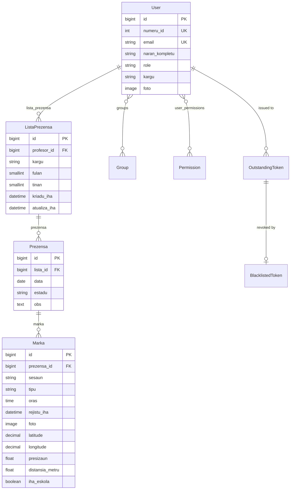

# ETI-Dili Attendance System — Project Context

Complete context for an AI coding agent. Everything here was read from source.
Anything not verifiable in code is marked **UNVERIFIED**.

Workspace root: `c:\workplace\eti-dili\` — two sibling projects, `eti-api/`
(backend) and `eti-mobile/` (Expo app). Paths below are relative to that root.

---

## 1. Project Overview

Digital replacement for the paper attendance book *"LISTA PREZENSA BA
PROFESÓR/A ETI DILI"* used by Escola Técnica de Informática Dili (ETI-Dili), a
technical school in Timor-Leste. Teachers clock in and out from a mobile app
four times a day (morning in/out, afternoon in/out); the handwritten signature
of the paper form is replaced by a photo taken at the punch plus GPS
coordinates, and the time is stamped by the server rather than written by hand.
Roles are `ADMIN`, `PROFESSOR` and `ESTUDANTE` (`eti-api/accounts/models.py`);
only PROFESSOR is exercised today, with ADMIN/staff gating the school-wide daily
report. Domain vocabulary and all model/field names are Tetun.

Source of the teacher data model: <https://eti-dili.sch.tl/dadus-professores/>
(57 staff — 33 male, 24 female — at time of reading).

---

## 2. Tech Stack

### Backend — `eti-api/requirements.txt`

| Package | Version |
| --- | --- |
| Django | 6.0.7 |
| djangorestframework | 3.17.1 |
| djangorestframework_simplejwt | 5.5.1 |
| PyJWT | 2.13.0 |
| django-environ | 0.14.0 |
| psycopg | 3.3.4 |
| psycopg-binary | 3.3.4 |
| pillow | 12.3.0 |
| asgiref | 3.12.1 |
| sqlparse | 0.5.5 |
| tzdata | 2026.3 |

- Python **3.14** (interpreter path `C:\Python314` seen in tracebacks).
- Database: **PostgreSQL** (`DB_ENGINE` in `.env`, `psycopg` v3 driver).
- Virtualenv at `eti-dili/env/` and `eti-api/venv/` both exist — **UNVERIFIED**
  which one is canonical; the running interpreter resolved to `eti-dili/env/`.

### Mobile — `eti-mobile/package.json`

| Package | Version |
| --- | --- |
| expo | ~54.0.30 |
| react-native | 0.81.5 |
| react | 19.1.0 |
| expo-router | ~6.0.21 |
| typescript | ~5.9.2 |
| axios | ^1.13.2 |
| expo-secure-store | ~15.0.8 |
| expo-camera | ~17.0.10 |
| expo-image-picker | ~17.0.11 |
| expo-location | ~19.0.8 |
| expo-image | ~3.0.11 |
| expo-haptics | ~15.0.8 |
| @react-navigation/bottom-tabs | ^7.4.0 |
| react-native-reanimated | ~4.1.1 |
| react-native-safe-area-context | ~5.6.0 |
| @expo/vector-icons | ^15.0.3 |
| eslint / eslint-config-expo | ^9.25.0 / ~10.0.0 |

App identity (`eti-mobile/app.json`): name **ETI PRESENSA**, slug
`EtiPresenca`, scheme `etipresenca`, Android package
`com.juliao125.EtiPresenca`, new architecture enabled, typed routes + React
Compiler experiments on.

### Admin dashboard

**There is no separate admin dashboard project.** Django admin is mounted at
`/admin/` (`eti-api/core/urls.py`), but `eti-api/accounts/admin.py` and
`eti-api/attendance/admin.py` are untouched stubs — **no models are
registered**, so the admin shows only Groups/Users-from-auth defaults. See
§10.

---

## 3. Repository Structure

```
eti-dili/
├─ eti-api/                     Django REST backend (not a git repo)
│  ├─ core/                     project config
│  │  ├─ settings.py            env-driven settings, JWT, geofence constants
│  │  ├─ urls.py                root URLconf: /admin/, /api/auth/, /api/
│  │  ├─ wsgi.py / asgi.py      deploy entry points
│  ├─ accounts/                 identity app
│  │  ├─ models.py              User (AUTH_USER_MODEL) + UserManager
│  │  ├─ serializers.py         UserSerializer, LoginSerializer, FotoSerializer
│  │  ├─ views.py               LoginView, LogoutView, MeView
│  │  ├─ urls.py                /api/auth/* routes
│  │  ├─ permissions.py         EhAdmin
│  │  ├─ tests.py               13 tests (auth flow, photo PATCH)
│  │  └─ migrations/            0001_initial, 0002_user_numeru_id
│  ├─ attendance/               the attendance book
│  │  ├─ models.py              ListaPrezensa, Prezensa, Marka + calendar helpers
│  │  ├─ serializers.py         punch input/output, istoria, daily report
│  │  ├─ views.py               PrezensaViewSet, ListaPrezensaViewSet
│  │  ├─ urls.py                DRF DefaultRouter
│  │  ├─ geo.py                 haversine distance + school geofence
│  │  ├─ tests.py               38 tests
│  │  └─ migrations/            0001_initial, 0002_…_marka
│  ├─ docs/
│  │  ├─ plan.md                this file
│  │  └─ schema-overview.html   standalone ER diagram + model cards
│  ├─ plan.md                   older "System Flow" narrative (superseded here)
│  ├─ manage.py
│  ├─ requirements.txt
│  └─ .env                      secrets — never read values into docs
│
└─ eti-mobile/                  Expo / React Native app (git repo)
   ├─ app/                      expo-router file routes
   │  ├─ _layout.tsx            root stack
   │  ├─ index.tsx              boot/redirect gate
   │  ├─ (auth)/index.tsx       login screen
   │  ├─ (eti)/_layout.tsx      bottom tab navigator
   │  ├─ (eti)/index.tsx        home "Veranda" — clock buttons
   │  ├─ (eti)/history.tsx      "Istoria" — monthly attendance
   │  ├─ (eti)/notification.tsx "Notifikasaun" — mock data
   │  ├─ (eti)/profile.tsx      "Perfil" — profile + photo upload
   │  ├─ clock.tsx              camera + punch flow
   │  └─ announcement.tsx       announcements — mock data
   ├─ components/               AttendanceCard, IstoriaDayCard, IstoriaSummary,
   │                            FulanPicker, LoadingBar, NotificationCard,
   │                            EmptyNotification
   ├─ lib/                      no-UI layer
   │  ├─ config.ts              API base URL + endpoint constants
   │  ├─ api.ts                 axios instance, JWT interceptors, refresh
   │  ├─ auth.ts                login/logout/me/photo upload
   │  ├─ storage.ts             SecureStore session persistence
   │  ├─ prezensa.ts            punch submission + local today cache
   │  ├─ istoria.ts             monthly history fetch + view models
   │  └─ location.ts            GPS permission + fix
   ├─ assets/images/
   ├─ app.json / eas.json / tsconfig.json / eslint.config.js
   └─ package.json
```

---

## 4. Features

### Backend — implemented

| Feature | Source |
| --- | --- |
| Custom user, email login, teacher fields from the school roster | `eti-api/accounts/models.py` |
| Required unique staff number `numeru_id` | `accounts/models.py` |
| JWT login returning tokens **plus** the profile in one response | `accounts/serializers.py` |
| Logout via refresh-token blacklist | `accounts/views.py` |
| Refresh with rotation + blacklist-after-rotation | `core/settings.py` |
| `GET /api/auth/me/`, `PATCH` photo only | `accounts/views.py` |
| Auto-opening monthly sheet + day row on first punch | `attendance/models.py` `PrezensaManager.ba_loron` |
| Clock in / clock out with photo + GPS evidence | `attendance/models.py` `_rejistu` |
| Session auto-detection at the 13:00 cut-off; `sesaun` override | `attendance/models.py`, `serializers.py` |
| Rules: no duplicate per session, no out-before-in, no Saturday afternoon | `attendance/models.py` |
| Geofence: refuse punches >100 m from school, with distance in the error | `attendance/models.py`, `geo.py` |
| Geofence kill-switch `ESKOLA_OBRIGA_FATIN` | `core/settings.py` |
| Late detection (`atrazadu`) vs scheduled column time | `attendance/models.py` `Marka.atrazadu` |
| Today's state for the home screen (`ohin`) with button flags | `attendance/views.py`, `serializers.py` |
| Monthly/weekly history with every working day and a summary | `attendance/views.py` `istoria` |
| School-wide daily report incl. teachers who have not punched | `attendance/views.py` `ohin_hotu` |
| Monthly sheets list/retrieve | `attendance/views.py` `ListaPrezensaViewSet` |
| GPS precision tolerance — server rounds instead of rejecting | `attendance/serializers.py` `KoordenadaField` |
| 51 automated tests, all passing | `accounts/tests.py`, `attendance/tests.py` |

### Mobile — implemented

| Feature | Source |
| --- | --- |
| Login screen + session persistence in SecureStore | `app/(auth)/index.tsx`, `lib/storage.ts` |
| Auto token refresh, single-flight, replay-once on 401 | `lib/api.ts` |
| Forced logout + redirect when refresh fails | `lib/api.ts` `forceLogin` |
| Bottom tabs: Veranda / Istoria / Notifikasaun / Perfil | `app/(eti)/_layout.tsx` |
| Home with clock in/out entry | `app/(eti)/index.tsx` |
| Camera punch flow with GPS capture | `app/clock.tsx`, `lib/location.ts` |
| Monthly + weekly history UI, month picker, summary, day cards | `app/(eti)/history.tsx`, `components/Istoria*` |
| Profile view + photo replacement | `app/(eti)/profile.tsx`, `lib/auth.ts` |
| Tetun permission prompts for camera/location/gallery | `app/app.json` |

### Unfinished

| Feature | Status |
| --- | --- |
| Notifications tab | **[WIP]** renders `notificationsMock` hardcoded in `app/(eti)/notification.tsx`; no API |
| Announcements screen | **[WIP]** hardcoded `announcementItems` in `app/announcement.tsx`; no API |
| Django admin for reviewing punches/photos | **[WIP]** no models registered (`*/admin.py` are stubs) |
| Admin/director UI for `ohin-hotu` | **[WIP]** endpoint exists; no client consumes it |
| Today's state from the server | **[WIP]** `/api/prezensa/ohin/` exists but mobile caches locally instead (`lib/prezensa.ts`) |
| Monthly PDF export of the sheet | Not started |
| Scheduled `flushexpiredtokens` | Not scheduled on any host |

---

## 5. Database Schema



### `accounts.User` — `eti-api/accounts/models.py`

Every account: teachers, admins, later students. Extends `AbstractUser` with
`username = None` and email as `USERNAME_FIELD`; doubles as the teacher's
personnel record.

- Key fields: `numeru_id` (PositiveInteger, **unique, required**, min 1),
  `email` (unique), `naran_kompletu` (150), `role` (ADMIN/PROFESSOR/ESTUDANTE,
  default PROFESSOR), `sexu` (MANE/FETO), `kargu` (120, free text),
  `habilitasaun_literaria`, `disiplina_hanorin` (255), `nu_kontaktu`,
  `foto` (ImageField `fotos/`), `nivel_edukasaun` (choices), `area_estudu`.
- `REQUIRED_FIELDS = ['numeru_id', 'naran_kompletu']`; ordering by name.
- Relations: **one user has many monthly sheets** (`user.lista_prezensa`).
  Inherited M2M to `auth.Group` and `auth.Permission` (unused — gating is on
  `role`).
- Derived: `is_professor`, `get_full_name()`, `get_short_name()`.

### `attendance.ListaPrezensa` — `eti-api/attendance/models.py`

One printed sheet = one teacher for one month; holds the form's header block.

- Key fields: `profesor` (FK), `kargu` (snapshot), `fulan` (1–12 choices),
  `tinan` (2000–2100), `kriadu_iha`, `atualiza_iha`.
- Unique `(profesor, fulan, tinan)`.
- Relations: **belongs to one teacher** (`related_name='lista_prezensa'`,
  CASCADE); **has many day rows** (`lista.prezensa`).
- `kargu` is the only field copied from the user — deliberate, so a promotion
  does not rewrite the title on an already-signed sheet. Filled in `save()`.

### `attendance.Prezensa` — `eti-api/attendance/models.py`

One row of the grid: one teacher, one day. **Stores no times.**

- Key fields: `lista` (FK), `data` (Date), `estadu`
  (PREZENTE/FALTA/LISENSA/MISAUN/FERIADU), `obs` (Text).
- Unique `(lista, data)`.
- Relations: **belongs to one sheet**; **has up to four punches**
  (`prezensa.marka`).
- Derived properties rebuild the printed grid: `loron` (weekday in Tetun),
  `sabadu`, `oras_dader_tama`, `oras_dader_fila`, `oras_lorokraik_tama`,
  `oras_lorokraik_fila`.
- Holds the business rules: `clock_in()`, `clock_out()`, `_rejistu()`,
  `sesaun_ba()`; constants `ORAS_*` (08:00/12:00/13:30/17:30) and
  `LIMITE_SESAUN = 13:00`.

### `attendance.Marka` — `eti-api/attendance/models.py`

One punch with its evidence — the replacement for the handwritten signature.

- Key fields: `prezensa` (FK), `sesaun` (DADER/LOROKRAIK), `tipu` (TAMA/FILA),
  `oras` (server-stamped), `rejistu_iha` (audit), `foto` (**required**,
  `prezensa/%Y/%m/`), `latitude`/`longitude` (Decimal 9,6, range-validated),
  `presizaun` (float, nullable), `distansia_metru` + `iha_eskola` (computed in
  `save()`).
- Unique `(prezensa, sesaun, tipu)` — the DB itself blocks a second punch in a
  session.
- Relations: **belongs to one day**; chain to a person is
  `Marka → Prezensa → ListaPrezensa → User`.
- Derived: `kolumna` (`ORAS_DADER_TAMA` …), `oras_orariu`, `atrazadu`
  (`None` for departures).

### Module-level helpers (`attendance/models.py`)

`Fulan` (IntegerChoices), `Sesaun`, `Tipu`, `LORON` map, `loron_servisu()`
(working days of a month, Sundays excluded), `semana_husi()` (week of month
from Monday), `data_ohin()` (single source of "today").

### Third-party tables

`rest_framework_simplejwt.token_blacklist` → `OutstandingToken` (FK to User)
and `BlacklistedToken` (1:1 to OutstandingToken). Plus Django defaults
(`auth_group`, `auth_permission`, `django_session`, `django_admin_log`,
`django_migrations`).

---

## 6. API Endpoints

Read from `eti-api/core/urls.py`, `accounts/urls.py`, `attendance/urls.py`
(DRF `DefaultRouter`), and the corresponding views/serializers.

Global default: `IsAuthenticated` on everything
(`REST_FRAMEWORK.DEFAULT_PERMISSION_CLASSES`, `core/settings.py`).
All paths **require the trailing slash**.

| Method | Path | Purpose | Auth | Request → Response |
| --- | --- | --- | --- | --- |
| POST | `/api/auth/login/` | Obtain tokens + profile | No | `{email, password}` → `{access, refresh, user{...}}`; 401 on bad credentials |
| POST | `/api/auth/refresh/` | Rotate tokens | No | `{refresh}` → `{access, refresh}`; old refresh blacklisted |
| POST | `/api/auth/verify/` | Check a token | No | `{token}` → `{}` / 401 |
| POST | `/api/auth/logout/` | Blacklist refresh token | Yes | `{refresh}` → 205 `{detail}`; 400 `{code: token_not_valid}` |
| GET | `/api/auth/me/` | Own profile | Yes | → `{id, numeru_id, email, naran_kompletu, kargu, foto, role, role_display}` |
| PATCH | `/api/auth/me/` | Replace profile photo | Yes | multipart `foto` (required) → full profile. Other fields ignored. `PUT` → 405 |
| GET | `/api/prezensa/` | List own day rows | Yes | → `PrezensaSerializer[]` scoped to `request.user` |
| GET | `/api/prezensa/{id}/` | One day row | Yes | → `PrezensaSerializer` |
| GET | `/api/prezensa/ohin/` | Today + button state (creates row) | Yes | → day + `sesaun`, `oras_tama`, `oras_fila`, `bele_clock_in`, `bele_clock_out`, `marka[]` |
| GET | `/api/prezensa/istoria/` | One month (or week) of own sheet | Yes | `?fulan&tinan&semana` → `{profesor, fulan, fulan_display, tinan, semana, rezumu{...}, loron[]}`; 400 `invalid_period` |
| GET | `/api/prezensa/ohin-hotu/` | Today for **all** teachers | Yes + **EhAdmin** | → `{data, loron, rezumu{total, marka_ona, seidauk_marka}, profesor[]}`; 403 otherwise |
| POST | `/api/prezensa/checkin/` | Arrival punch | Yes | multipart `foto`,`latitude`,`longitude`,`presizaun?`,`sesaun?` → 201 day + `marka_foun` |
| POST | `/api/prezensa/checkout/` | Departure punch | Yes | same → 201 |
| GET | `/api/lista-prezensa/` | Own monthly sheets | Yes | → `ListaPrezensaSerializer[]` with nested days |
| GET | `/api/lista-prezensa/{id}/` | One monthly sheet | Yes | → sheet + `prezensa[]` |
| GET | `/api/` | DRF browsable API root | Yes | Router-generated index |
| — | `/admin/` | Django admin | Session | No project models registered |
| — | `/media/*` | Uploaded photos | No | Served **only when `DEBUG=True`** (`core/urls.py`) |

### Punch error codes (400, `{detail, code, …}`)

| code | Meaning | Extra |
| --- | --- | --- |
| `duplicate` | Already punched this session | `oras` |
| `no_clock_in` | Clock-out before clock-in | — |
| `no_session` | Saturday afternoon | — |
| `dook_husi_eskola` | Beyond the geofence radius | `distansia` (m) |
| `invalid_period` | Bad `fulan`/`tinan`/`semana` | — |
| `token_not_valid` | Expired/blacklisted token | — |

---

## 7. Auth & Permissions

Config: `eti-api/core/settings.py` (`SIMPLE_JWT`, `REST_FRAMEWORK`).

| Setting | Value |
| --- | --- |
| `ACCESS_TOKEN_LIFETIME` | 15 minutes |
| `REFRESH_TOKEN_LIFETIME` | 30 days |
| `ROTATE_REFRESH_TOKENS` | True |
| `BLACKLIST_AFTER_ROTATION` | True |
| `UPDATE_LAST_LOGIN` | True |
| Auth class | `rest_framework_simplejwt.authentication.JWTAuthentication` |
| Default permission | `IsAuthenticated` |

### Flow

1. **Login** — `LoginSerializer` (extends `TokenObtainPairSerializer`)
   authenticates by **email**, signs HS256 tokens with `SECRET_KEY`, embeds
   `naran_kompletu` and `role` as custom claims, and attaches the serialized
   user so the app draws its header without a second call.
2. **Validation** — `JWTAuthentication` verifies signature and `exp` on each
   request; stateless, no DB lookup of the token.
3. **Refresh** — returns a new access **and** refresh token, blacklisting the
   used one. Because rotation resets the lifetime, `REFRESH_TOKEN_LIFETIME` is
   effectively an **idle timeout**.
4. **Logout** — blacklists the refresh token (205). The already-issued access
   token stays valid until it expires (≤15 min) — inherent to stateless JWT,
   documented in `eti-api/plan.md`.

### Roles & route protection

| Route group | Protection |
| --- | --- |
| `/api/auth/login|refresh|verify/` | Public |
| Everything else under `/api/` | `IsAuthenticated` (global default) |
| `/api/prezensa/ohin-hotu/` | `IsAuthenticated` + `EhAdmin` (`accounts/permissions.py`: `is_staff` **or** `role == ADMIN`) |
| All other attendance routes | Scoped by queryset to `request.user` — a teacher cannot read another's data even by guessing an id |
| `/admin/` | Django session auth, staff only |

### Client side — `eti-mobile/lib/`

- Tokens and cached profile in **expo-secure-store** (`storage.ts`):
  `access_token`, `refresh_token`, `user_profile`; legacy `auth_token` cleared.
- `api.ts`: request interceptor attaches the Bearer token and mints one
  pre-emptively if absent; response interceptor refreshes once on 401, replays
  the request, else `forceLogin()`. Refresh is **single-flight**.
- `PUBLIC_PATHS` (login/refresh/verify) never carry a token and are never
  retried.
- Multipart: `Content-Type` is set to `false` so React Native can attach its own
  boundary — documented at length in `lib/api.ts`.

---

## 8. Conventions

### Naming

| Convention | Example |
| --- | --- |
| Domain names in **Tetun**, on models, fields, serializers, actions | `Prezensa`, `Marka`, `naran_kompletu`, `oras_dader_tama`, `ba_loron()` |
| Framework/infra names in English | `LoginView`, `get_queryset`, `related_name` |
| Model verbose names wrapped in `gettext_lazy as _` | all fields in both apps |
| Choices as nested `TextChoices`/`IntegerChoices` | `User.Role`, `Prezensa.Estadu`, `Fulan` |
| DB constraints named explicitly | `unique_marka_prezensa_sesaun_tipu` |
| URL segments kebab-case, resource-first | `/api/prezensa/ohin-hotu/` |
| React components PascalCase, `lib/` modules lowercase | `IstoriaDayCard.tsx`, `lib/istoria.ts` |
| TS types mirror API field names exactly (Tetun preserved) | `LoronRecord`, `Rezumu`, `Kolumna` |

### Code organisation

- **Business rules live on the model**, not the view: `Prezensa._rejistu()`
  owns every punch rule; views only validate, delegate, serialize.
- **Managers own creation**: `Prezensa.objects.ba_loron()` is the only path
  that creates a sheet or a day row.
- **Derived data is a property, never a column** — `loron`, `oras_*`,
  `kolumna`, `atrazadu`; storing them would let them disagree with their source.
- **One source of truth for "today"**: `data_ohin()` in
  `attendance/models.py`, used by both views and managers.
- Read serializers are fully `read_only_fields`; a separate serializer handles
  each write (`MarkaPrezensaSerializer`, `FotoSerializer`).
- Custom DRF field for lenient input: `KoordenadaField` rounds GPS precision
  instead of rejecting it.
- Mobile keeps **all network/state code in `lib/`**; screens in `app/` are
  presentation + local state only.

### Comment style

Comments explain **why**, not what — e.g. why `kargu` is denormalized, why
`partial=True` is not used on the photo PATCH, why `Content-Type` is set to
`false` in the axios interceptor. Follow this when editing.

### Testing

- Django `TestCase`/`APITestCase`, no pytest. 51 tests total (13 accounts,
  38 attendance).
- Media isolated per test class via `override_settings(MEDIA_ROOT=tempfile…)`.
- Time-sensitive API tests **pin the clock** by patching
  `attendance.models.timezone` and `attendance.serializers.timezone`
  (`attendance/tests.py` `oras_ohin`), so a Saturday-afternoon run cannot fail
  spuriously.
- Geofence tests pin `ESKOLA_OBRIGA_FATIN=True` with `override_settings`
  because the local `.env` disables it.
- No frontend tests exist. **[WIP]**

---

## 9. How to Run

### Backend — from `eti-api/`

```bash
pip install -r requirements.txt
python manage.py migrate
python manage.py createsuperuser      # prompts email, numeru_id, naran_kompletu
python manage.py runserver 0.0.0.0:8000   # 0.0.0.0 so a phone on the LAN can reach it
python manage.py test                 # 51 tests
python manage.py flushexpiredtokens   # housekeeping, run weekly
```

Required `.env` keys at `eti-api/.env` (**names only**):

| Variable | Purpose |
| --- | --- |
| `SECRET_KEY` | Django signing key |
| `DEBUG` | Debug flag |
| `ALLOWED_HOSTS` | Comma-separated hosts |
| `DB_ENGINE`, `DB_NAME`, `DB_USER`, `DB_PASSWORD`, `DB_HOST`, `DB_PORT` | PostgreSQL connection |
| `ESKOLA_LATITUDE`, `ESKOLA_LONGITUDE` | School coordinates (defaults `-8.552336, 125.541603`) |
| `ESKOLA_RAIU_METRU` | Geofence radius (default 100.0) |
| `ESKOLA_OBRIGA_FATIN` | Enforce the geofence (default True) |

`.env` is loaded by `environ.Env.read_env(BASE_DIR / '.env')` in
`core/settings.py` — it must run before any `env()` call.

### Mobile — from `eti-mobile/`

```bash
npm install
npx expo start          # or: npm run android | npm run ios | npm run web
npm run lint
```

| Variable | Purpose |
| --- | --- |
| `EXPO_PUBLIC_API_URL` | Backend base URL; falls back to a hardcoded LAN IP in `lib/config.ts` |

Device and server must be on the same network; the fallback address in
`lib/config.ts` is a development LAN IP and will not work elsewhere.

### Pre-production checklist (from `eti-api/plan.md`)

`DEBUG=False` · real `ALLOWED_HOSTS` · web server serving `MEDIA_ROOT` (the
`/media/` route is DEBUG-only) · TLS · rotate `SECRET_KEY` off the
`django-insecure-` default · remove `ESKOLA_OBRIGA_FATIN=False`.

---

## 10. Known Issues / TODOs

No `TODO`/`FIXME` comments exist in either codebase. The following were found by
reading the code.

### Contract drift between mobile and backend

| # | Issue | Location |
| --- | --- | --- |
| 1 | `PREZENSA_ENDPOINTS.istoriaOhin` points at `/api/prezensa/istoria-ohin/`, which **no longer exists** (renamed to `istoria/`). Dead constant; a 404 if used. | `eti-mobile/lib/config.ts` |
| 2 | The punch form sends a `periodu` field the backend does not accept or read; the server derives the column itself. Harmless but misleading. | `eti-mobile/lib/prezensa.ts` |
| 3 | Comment claims "there is no read endpoint for today's record yet" and caches punches in SecureStore. `/api/prezensa/ohin/` **does** exist and is authoritative; the local cache can drift from the server. | `eti-mobile/lib/prezensa.ts` |
| 4 | Client session split uses **13:30** as the morning/afternoon boundary; the backend uses **13:00** (`LIMITE_SESAUN`). A punch between 13:00 and 13:30 is filed by the server in the afternoon while the app labels it morning. | `eti-mobile/lib/prezensa.ts` vs `eti-api/attendance/models.py` |
| 5 | The app does not handle the backend's error `code`s — only generic messages. In particular `duplicate` is shown as a failure although the punch **was** recorded, so a dropped response makes recorded attendance look failed. | `eti-mobile/lib/api.ts` `apiErrorMessage` |
| 6 | `presizaun` (GPS accuracy) is never sent, so the field is always null. | `eti-mobile/lib/prezensa.ts` |

### Backend

| # | Issue |
| --- | --- |
| 7 | **No models registered in Django admin** — `accounts/admin.py`, `attendance/admin.py` are stubs. There is no way for an administrator to review punches, photos or flagged locations. |
| 8 | `ESKOLA_OBRIGA_FATIN=False` is currently set in `eti-api/.env` for testing — the geofence is **disabled**; punches from anywhere are accepted. |
| 9 | `SECRET_KEY` in `.env` still carries the `django-insecure-` development prefix, and `ALLOWED_HOSTS=*`. |
| 10 | No upload size or dimension limit on `foto` (profile or punch); a modern phone sends 3–8 MB per punch, ~4 punches/day/teacher. |
| 11 | `eti-api` is **not a git repository** (no `.git`), so backend history is untracked. `eti-mobile` is. |
| 12 | Blacklist tables grow ~1 row per refresh; `flushexpiredtokens` is not scheduled anywhere. |
| 13 | Logout cannot revoke an already-issued access token (≤15 min window) — inherent to stateless JWT, not a defect. |
| 14 | `ohin-hotu` lists `role=PROFESSOR` users only. A director granted access via superuser status disappears from their own report — data-modelling decision still open. |
| 15 | Django's `TIME_ZONE` is `Asia/Dili`; the home screen mock in the original design showed "WIB" (UTC+7). **UNVERIFIED** whether any client formats times in a non-Dili zone. |
| 16 | `estadu` values FALTA / LISENSA / MISAUN / FERIADU exist but nothing ever sets them — any punch forces PREZENTE, and no endpoint writes the others. |
| 17 | `obs` (the OBS column) is never written by any endpoint. |

### Environment

| # | Issue |
| --- | --- |
| 18 | Two virtualenvs (`eti-dili/env/`, `eti-api/venv/`). **UNVERIFIED** which is intended. |
| 19 | `eti-api/plan.md` (older System Flow narrative) overlaps this document; keep them in sync or fold one into the other. |

---

## Tetun glossary

`prezensa` attendance · `marka` punch · `lista prezensa` attendance sheet ·
`profesor` teacher · `naran kompletu` full name · `kargu` position ·
`foto` photo · `oras` time · `loron` day/weekday · `fulan` month ·
`tinan` year · `semana` week · `dader` morning · `lorokraik` afternoon ·
`tama` in/enter · `fila` out/return · `atrazadu` late · `estadu` status ·
`iha eskola` at school · `dook` far · `rezumu` summary · `seidauk` not yet ·
`eskola` school · `raiu` radius · `distansia` distance · `presizaun` accuracy ·
`sesaun` session · `tipu` type · `numeru` number · `sexu` sex ·
`bele` can/allowed · `hotu` all · `ohin` today · `istoria` history
